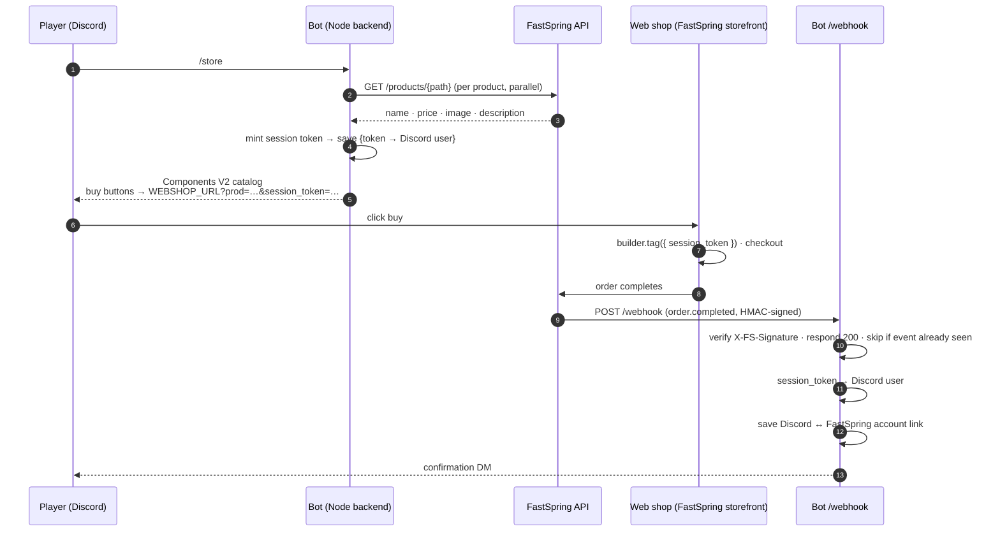

# Build a Discord In-Game Store with FastSpring

Sell in-game items to your Discord community without leaving Discord. Players
run `/store`, get a branded catalog with live prices and artwork, buy on your
FastSpring web shop, and receive a confirmation DM the moment the order
completes. VIP players see exclusive items — gated by a Discord role or an
active FastSpring subscription.

This guide walks through the complete build: the architecture, every design
decision, and the code behind each piece. By the end you'll understand not just
*what* each file does but *why* it's shaped that way, so you can adapt it to
your own game and catalog.

**Stack:** Node.js 18+, [discord.js](https://discord.js.org) v14 (Components V2),
Express, and the FastSpring API + webhooks. No database — a JSON file stands in
so the reference stays easy to read; swapping it for a real one is a
[documented step](#production-hardening).

---

## What you'll build

| Feature | What the player sees |
|---|---|
| **`/store`** | A private (ephemeral) message: header, "browse the full store" button, then one card per product — artwork, name, description, price, and its own buy button. VIPs get a ⭐ **VIP Exclusives** section on top; everyone else sees a **Unlock VIP** upsell. |
| **`/announce`** | A public post, for community managers only: headline, message, optional `@everyone`, and up to three featured products with buy buttons. |
| **Purchase confirmation** | Seconds after checkout, a DM: *"Thank you for your purchase! Your order (`…`) has been processed and your items have been granted."* |
| **VIP status** | Earned two ways: a moderator assigns the VIP role, **or** the player's FastSpring account has an active subscription (e.g. a Battle Pass). |

FastSpring owns the catalog. Product names, prices, images and descriptions are
fetched live from the FastSpring API on every `/store` — change a price in the
dashboard and the bot reflects it immediately, with no deploy.

---

## Architecture

The bot follows the standard FastSpring integration shape — **Client → Backend →
FastSpring → Webhook → Backend** — with Discord as the client:



Three principles drive every decision below:

1. **The backend is the only thing that talks to FastSpring with credentials.**
   The Discord client sees product data and links; it never sees API keys, the
   webhook secret, or another player's identity.
2. **Identity travels as an opaque token, never as a raw Discord id.** Query
   strings are visible and editable. A `?uid=…` in the link could be swapped to
   credit someone else's account. A random, expiring token means nothing off the
   server.
3. **The webhook is the source of truth for "paid".** Nothing is granted, linked,
   or confirmed because a button was clicked — only when FastSpring says
   `order.completed`, and only once per event.

### Where each concern lives

```
src/
  index.js              boot: webhook server first, then the Discord client
  bot.js                Discord client · command registration · dispatch
  commands/
    store.js            /store — builds the Components V2 catalog
    announce.js         /announce — CM-gated public post
  ui.js                 shared Components V2 helpers (product cards, budget)
  presentation.js       branding + WHICH products appear where   ← the file you edit
  vip.js                VIP decision: role OR active subscription
  roles.js              Discord role check
  fastspring/
    api.js              REST client — Basic Auth lives here and nowhere else
    catalog.js          GET /products/{path}
    accounts.js         GET /accounts?subscriptions=active (paginated)
    session.js          web-shop links · session token minting
  store/
    repository.js       JSON store: identity links · processed events · sessions
  web/
    server.js           Express (raw body on /webhook so HMAC can be verified)
    routes/webhook.js   the FastSpring webhook handler
```

---

## Prerequisites

- **Node.js 18+** (`node -v`). The bot uses Node's built-in `fetch` and test runner.
- A **FastSpring** account with at least one published product, a **web
  storefront**, and **API credentials**.
- A **Discord** account with permission to add a bot to a server.
- A **tunnel** (e.g. [ngrok](https://ngrok.com)) so FastSpring can reach your
  local `/webhook` during development.

---

## Part 1 — Project setup

```bash
git clone <this repo> && cd fsbuilds-monetization-bot
npm install
cp .env.example .env
```

Every secret lives in `.env`, which is gitignored and must never be committed.
`.env.example` documents each variable and exactly where to find its value —
keep it open as you work through Parts 2 and 3.

The dependency list is deliberately short:

| Package | Why |
|---|---|
| `discord.js` | Discord gateway, slash commands, Components V2 builders |
| `express` | The HTTP server that receives FastSpring webhooks |
| `dotenv` | Loads `.env` into `process.env` |

No HTTP client — Node 18's `fetch` handles FastSpring API calls.

---

## Part 2 — Create the Discord application

1. [Discord Developer Portal](https://discord.com/developers/applications) → **New Application**.
2. **General Information** → copy **Application ID** → `DISCORD_CLIENT_ID`.
3. **Bot** → **Reset Token** → copy → `DISCORD_TOKEN`. *(Shown once. Treat it like a password.)*
4. Invite the bot with **both** scopes — `bot` is required or the bot can't DM buyers:

   ```
   https://discord.com/api/oauth2/authorize?client_id=<CLIENT_ID>&permissions=2147567616&scope=bot%20applications.commands
   ```

5. In the Discord app, enable Developer Mode (User Settings → Advanced), then
   right-click your server → **Copy Server ID** → `DISCORD_GUILD_ID`.

> **Why a guild id?** Commands registered to one guild appear instantly. Global
> registration can take up to an hour to propagate — fine for production, painful
> for development. `bot.js` uses `Routes.applicationGuildCommands`; switch to
> `Routes.applicationCommands` for a global rollout.

### Roles (optional)

Create two roles in your server and copy their ids into `.env`:

- **VIP** → `DISCORD_VIP_ROLE_ID` — sees the exclusive items.
- **Community Manager** → `DISCORD_CM_ROLE_ID` — may run `/announce`.

Both are optional. Blank `DISCORD_VIP_ROLE_ID` = VIP by subscription only. Blank
`DISCORD_CM_ROLE_ID` = anyone with **Manage Server** can announce.

---

## Part 3 — Connect FastSpring

**API credentials** — Dashboard → **Integrations → API Credentials → Create
Credentials** → `FASTSPRING_API_USER` / `FASTSPRING_API_PASSWORD`. The password
is shown only at creation.

**Web shop** — the storefront page your buy buttons open → `WEBSHOP_URL`.
Include the scheme: the bot parses this with `new URL()`, and a bare
`store.example.com` throws `ERR_INVALID_URL`.

**Webhook secret** — Dashboard → **Integrations → Webhooks** → your endpoint's
**HMAC SHA256 Secret** → `FS_WEBHOOK_SECRET`. Use the *same* value in both
places; it's how the bot proves an inbound request came from FastSpring. You'll
finish the endpoint in [Part 10](#part-10--expose-the-webhook-and-run-it) once
you have a public URL.

---

## Part 4 — Talk to the FastSpring API

### One client, one place for credentials

`src/fastspring/api.js` is the only file that reads the API credentials. Every
other FastSpring module calls `fsApi.get(path)` and stays focused on its domain.

```js
// src/fastspring/api.js
const API_BASE = 'https://api.fastspring.com';

function authHeader() {
    const user = process.env.FASTSPRING_API_USER;
    const pass = process.env.FASTSPRING_API_PASSWORD;
    if (!user || !pass) throw new Error('Missing FASTSPRING_API_USER / FASTSPRING_API_PASSWORD in .env');
    // FastSpring uses HTTP Basic Auth: "Basic " + base64("username:password")
    return `Basic ${Buffer.from(`${user}:${pass}`).toString('base64')}`;
}

async function get(path) {
    const response = await fetch(`${API_BASE}${path}`, {
        headers: { Authorization: authHeader(), Accept: 'application/json' },
    });
    if (!response.ok) throw new Error(`FastSpring API ${path} → ${response.status} ${response.statusText}`);
    return response.json();
}
```

### Fetching products

`GET /products/{path}` returns the full product — display name, pricing,
`image` (a CDN URL Discord can render directly), and description. Two things
worth knowing about the response shape:

- It wraps the product in a `products` **array**, even for a single path.
- Pricing is `pricing.price.USD` — a raw number, not a formatted string.

```js
// src/fastspring/catalog.js
async function fetchProduct(productPath) {
    const data = await fsApi.get(`/products/${encodeURIComponent(productPath)}`);
    if (data.products?.length) return data.products[0];
    throw new Error(`Product "${productPath}" not found in API response.`);
}

async function fetchProducts(paths) {
    const results = await Promise.all(
        paths.map((path) =>
            fetchProduct(path).catch((err) => {
                console.warn(`[catalog] Could not fetch product "${path}":`, err.message);
                return null;   // skip, don't fail the whole store over one bad path
            })
        )
    );
    return results.filter(Boolean);
}
```

`fetchProducts` fetches in parallel and **skips** failures rather than throwing.
A typo in one product path degrades the store by one card instead of taking it
down for everyone.

---

## Part 5 — The `/store` command

### Choose what to show: `presentation.js`

This is the one file you edit to change the store. Paths must match your
FastSpring product paths exactly.

```js
// src/presentation.js
const STORE_BRANDING = {
    name: 'Eggblast Arena',
    title: '🛒 Item Shop',
    tagline: 'Stock up on coins and passes to dominate the arena…',
    color: 0x0099ff,            // accent bar on the container
};

const FEATURED_PRODUCTS = ['100-coins', 'battle-pass'];   // everyone; array order = display order
const VIP_PRODUCTS      = ['500-coins', 'mega-pack'];     // VIPs only
const VIP_UPSELL_PRODUCT = 'battle-pass';                  // what a non-VIP is nudged to buy
```

`VIP_UPSELL_PRODUCT` should be a **subscription** product, because VIP-by-
subscription checks for an active subscription on the buyer's account.

### Why Components V2

The classic Discord message is an embed plus rows of buttons underneath. For a
catalog that's awkward: five buttons in a row, and nothing visually tying a
button to its product. **Components V2** (discord.js ≥ 14.19) replaces the embed
with a `ContainerBuilder` holding typed children — and one of those children, a
`SectionBuilder`, groups text with an *accessory* (a thumbnail or a button). Each
product becomes a card with its own artwork and its own buy button.

Three rules bite if you forget them; `src/ui.js` centralizes handling all three:

1. **No `content` or `embeds`** on a V2 message. Everything visible — including an
   `@everyone` ping — lives inside a `TextDisplayBuilder`.
2. **40 components max**, and *everything* counts: the container, each section,
   each text display, each thumbnail, each row, each button. A product card
   costs ~5. The store budgets rather than let Discord reject the message.
3. **Send with `flags: MessageFlags.IsComponentsV2`.**

```js
// src/ui.js — one product card
function appendProductCard(container, item, checkoutUrl) {
    const text = new TextDisplayBuilder().setContent(`### ${item.displayName}\n${item.blurb}\n**${item.price}**`);
    const button = linkButton(`Buy ${item.displayName} — ${item.price}`, checkoutUrl);
    const section = new SectionBuilder().addTextDisplayComponents(text);

    if (item.imageUrl) {
        // Artwork as the accessory; button on its own row beneath. (5 components)
        section.setThumbnailAccessory(new ThumbnailBuilder().setURL(item.imageUrl));
        container.addSectionComponents(section);
        container.addActionRowComponents(new ActionRowBuilder().addComponents(button));
    } else {
        // No artwork → the button becomes the accessory, inline. (3 components)
        section.setButtonAccessory(button);
        container.addSectionComponents(section);
    }
}
```

### Assembling the message

`store.js` separates **building** the container from **executing** the command,
so the builder can be unit-tested without a live Discord interaction:

```js
// src/commands/store.js (abridged)
function buildStoreContainer({ featured, vipItems, upsell, isVip, checkoutUrlFor }) {
    const container = new ContainerBuilder().setAccentColor(resolveColor(STORE_BRANDING.color));

    container
        .addTextDisplayComponents(new TextDisplayBuilder().setContent(`# ${STORE_BRANDING.name} — ${STORE_BRANDING.title}\n${STORE_BRANDING.tagline}`))
        .addActionRowComponents(new ActionRowBuilder().addComponents(linkButton('Browse the Full Store', browseUrl())))
        .addSeparatorComponents(new SeparatorBuilder());

    if (isVip && vipItems.length) {
        container.addTextDisplayComponents(new TextDisplayBuilder().setContent('## ⭐ VIP Exclusives\n…'));
        for (const item of vipItems) appendProductCard(container, item, checkoutUrlFor(item.path));
    } else if (!isVip && upsell) {
        container.addTextDisplayComponents(new TextDisplayBuilder().setContent(`## ⭐ Unlock VIP Exclusives\nSubscribe to **${upsell.displayName}** (${upsell.price})…`));
        container.addActionRowComponents(new ActionRowBuilder().addComponents(linkButton(`Unlock VIP — …`, checkoutUrlFor(upsell.path))));
    }

    container.addTextDisplayComponents(new TextDisplayBuilder().setContent('## 🛒 Featured Items\n…'));
    for (const item of featured) appendProductCard(container, item, checkoutUrlFor(item.path));

    return container;
}
```

`execute()` does the I/O around it. Two details matter:

- **Defer first.** Discord gives you 3 seconds to acknowledge an interaction;
  FastSpring calls can take longer. `deferReply()` buys 15 minutes.
- **Fetch the catalog and check VIP concurrently.** They're independent, so
  `Promise.all` saves a full round trip.

```js
await interaction.deferReply({ flags: MessageFlags.Ephemeral });

const [featuredRaw, vipStatus] = await Promise.all([
    fetchProducts(FEATURED_PRODUCTS),
    checkVip(interaction).catch(() => ({ vip: false })),   // a VIP hiccup shouldn't break the store
]);
// … fetch VIP items or the upsell, describe products, build the container …
await interaction.editReply({ components: [container], flags: MessageFlags.IsComponentsV2 });
```

> **Hiding is presentation, not enforcement.** VIP products are hidden from
> non-VIPs in Discord, but anyone with the product path could reach the web
> shop. For true exclusivity, gate the offer on the FastSpring side — a
> subscriber-only product or a targeted coupon.

---

## Part 6 — Carry the buyer's identity to checkout

This is the piece that makes the confirmation DM and subscription-VIP possible,
and the one most often gotten wrong.

### The problem

When FastSpring fires `order.completed`, the payload knows the FastSpring
account and email — but nothing about Discord. The bot has to get the Discord
identity **onto the order** at checkout time, and the only mechanism FastSpring
offers for arbitrary data is **order tags**, set by the storefront via the Store
Builder Library: `fastspring.builder.tag({ key: value })`.

So the question is: what does *your* web shop read from the URL and tag onto the
order? In this build the hosted shop reads:

| Query param | What the shop does with it |
|---|---|
| `prod` | pushes the product into the cart and opens checkout |
| `coupon` | applies a coupon |
| `session_token` | **tags the order**: `builder.tag({ session_token })` |

It does *not* read `uid` or `uname`. Sending them does nothing — the order
arrives untagged and the webhook can't identify the buyer. **Check what your
storefront actually tags before writing the webhook.**

### The solution: session tokens

Rather than put the Discord id in the URL, the bot mints an unguessable token
per checkout, remembers whose it is, and sends only the token:

```js
// src/fastspring/session.js
function generateCheckoutUrl(productPath, discordUserId, discordUsername) {
    const url = requireWebshopUrl();                                   // validates WEBSHOP_URL has a scheme
    const token = createCheckoutSession({ discordUserId, discordUsername }); // saved server-side
    url.searchParams.set('prod', productPath);
    url.searchParams.set('session_token', token);
    return url.toString();
}
```

```js
// src/store/repository.js
function createCheckoutSession({ discordUserId, discordUsername }) {
    const token = crypto.randomBytes(24).toString('base64url');   // 192 bits, URL-safe
    const db = load();
    db.checkoutSessions = db.checkoutSessions.filter((s) => Date.now() - s.createdAtMs < SESSION_TTL_MS); // prune
    db.checkoutSessions.push({ token, discordUserId, discordUsername, createdAtMs: Date.now(), … });
    save(db);
    return token;
}
```

Why this beats a raw id in the URL:

- **Tamper-proof.** The token has no meaning off the server. Editing it yields
  "unknown token", not "credit a different player".
- **Expiring.** 24-hour TTL, pruned on every write.
- **Not consumed on use.** A player may buy more than one item from the same
  `/store` message; the token stays valid until it expires.

The `/announce` command uses `featureUrl()` instead — `?prod=` only, no token —
because a public post has no single buyer to attribute the click to.

> **Higher-value goods?** Look at FastSpring **Secure Payloads** to sign the
> cart contents themselves, so a buyer can't change the product or price either.

---

## Part 7 — The webhook

`src/web/routes/webhook.js` is the most security-sensitive file in the project.
It does five things, in a deliberate order.

### 1. Verify the signature — on the raw body

FastSpring signs the **exact bytes** of the request body with HMAC-SHA256 and
sends the Base64 digest in `X-FS-Signature`. If any middleware parses the body
first, the bytes you hash won't match. So `server.js` mounts `express.raw()` on
`/webhook` **before** anything else:

```js
// src/web/server.js
app.use('/webhook', express.raw({ type: 'application/json' }));   // req.body stays a Buffer
app.use('/webhook', webhookRoute);
```

```js
// src/web/routes/webhook.js
const hash = crypto.createHmac('sha256', secret).update(req.body).digest('base64');
const signatureBuffer = Buffer.from(signatureHeader);
const hashBuffer = Buffer.from(hash);

if (signatureBuffer.length !== hashBuffer.length || !crypto.timingSafeEqual(signatureBuffer, hashBuffer)) {
    return res.status(401).send('Invalid signature');
}
```

`timingSafeEqual` compares in constant time so an attacker can't learn the
correct signature byte-by-byte from response timing. It throws on
different-length inputs, hence the length check first.

### 2. Acknowledge immediately, process in the background

FastSpring retries on a slow or non-2xx response. Doing Discord API work
(seconds, or a hang) *before* replying is exactly what causes duplicate
deliveries — and therefore duplicate DMs.

```js
res.status(200).send('Webhook received');          // ack first

for (const event of payload.events || []) {
    processEvent(event).catch((err) => console.error(`[Webhook] Error processing ${event?.id}:`, err.message));
}
```

### 3. Idempotency — process each event once

FastSpring delivers **at least once**. Anything with a side effect must check
whether it has already run:

```js
async function processEvent(event) {
    if (hasProcessedEvent(event.id)) return;          // retry → skip
    if (event.type === 'order.completed') await handleOrderCompleted(event);
    markEventProcessed(event.id);
}
```

The reference stores processed ids in `data/links.json` (a rolling window of
1000). In production, use a database with a **unique constraint** on the event
id so two concurrent deliveries can't both pass the check.

### 4. Identify the buyer

Read fields off `event.data` at the **top level** — `data.order` is the order id
as a *string*, not a nested object.

```js
const orderData = event.data;
const tags = orderData.tags || {};

const session = getCheckoutSession(tags.session_token);      // our token → Discord user
const discordUserId = session?.discordUserId || tags.discord_uid || tags.discordUserId;   // fallbacks for a storefront that tags the id directly
```

### 5. Link identities and confirm

A completed order proves the buyer controls **both** identities — the Discord
account that clicked and the FastSpring account that paid. That's a trusted,
zero-friction link, and it's what makes subscription-VIP possible later:

```js
upsert({ discordUserId, fsAccountId: orderData.account, email: orderData.customer?.email });

// ─── GRANT ITEMS ─── this is where your game server's API goes:
//   for (const item of orderData.items || []) await gameServerApi.grantItem(discordUserId, item.product, item.quantity);

const guild = await client.guilds.fetch(process.env.DISCORD_GUILD_ID);
const member = await guild.members.fetch(discordUserId);   // resolve THROUGH the guild
await member.send(`🎉 **Thank you for your purchase!** Your order (\`${orderId}\`) has been processed…`);
```

> **Why fetch the member through the guild** rather than `client.users.fetch()`?
> Discord will only open a DM from a bot that shares a server with the user.
> Fetching via the guild establishes that mutual-guild link; a bare user fetch
> commonly fails with "cannot send messages to this user". A single member fetch
> uses REST and does *not* require the privileged `GuildMembers` intent.

---

## Part 8 — VIP gating

A player is VIP if **either** source says so:

```js
// src/vip.js
async function checkVip(interaction) {
    const viaRole = hasRole(interaction, process.env.DISCORD_VIP_ROLE_ID);   // instant, no network

    let viaSubscription = false;
    const link = repository.getByDiscordId(interaction.user.id);           // needs a prior purchase
    if (link?.fsAccountId) {
        try { viaSubscription = await accounts.hasActiveSubscription(link.fsAccountId); }
        catch (err) { console.warn('[vip] Subscription check failed:', err.message); }   // fall back to role-only
    }
    return { vip: viaRole || viaSubscription, viaRole, viaSubscription };
}
```

**Role** — moderator-managed, instant, no purchase. Blank env var = off.

**Subscription** — the "paid VIP" signal, verified live via
`GET /accounts?subscriptions=active`. Two things to know:

- It depends on the identity link from Part 7, so it's dormant for a player
  until their first purchase through `/store`.
- That endpoint is **paginated**. A single request only sees the first page;
  once you have more subscribers than a page holds, later accounts would
  silently read as "not VIP". `accounts.js` walks `totalPages` and stops on the
  first match.

```js
// src/roles.js — handles both shapes interaction.member.roles arrives in
function hasRole(interaction, roleId) {
    if (!roleId) return false;                       // unset = feature off, never "everyone qualifies"
    const roles = interaction.member?.roles;
    if (!roles) return false;
    if (typeof roles.cache?.has === 'function') return roles.cache.has(roleId);   // GuildMemberRoleManager
    if (Array.isArray(roles)) return roles.includes(roleId);                    // raw id array
    return false;
}
```

---

## Part 9 — The `/announce` command

Same building blocks, three differences:

**Permission gate.** The Community Manager role if configured, else Manage
Server. The command is also registered with
`setDefaultMemberPermissions(PermissionFlagsBits.ManageGuild)`, which *hides* it
from members without Manage Server. To surface it to your CM role: **Server
Settings → Integrations → your bot → Command Permissions → `/announce`** → allow
the role. That's a Discord-side setting the bot can't set for you.

**Public, not ephemeral.** The announcement goes to `interaction.channel.send()`
so the whole channel sees it; the command runner gets a private "✅ posted"
confirmation via `editReply`.

**Pinging.** V2 forbids `content`, so `@everyone` is written into the text
component — and `allowedMentions: { parse: ['everyone'] }` on the send call is
what actually makes it notify. Without that, Discord renders the text but
silently suppresses the ping.

```js
await interaction.channel.send({
    allowedMentions: { parse: ping ? ['everyone'] : [] },
    components: [container],
    flags: MessageFlags.IsComponentsV2,
});
```

---

## Part 10 — Expose the webhook and run it

1. Start a tunnel to your port (`PORT`, default 3000):

   ```bash
   ngrok http 3000
   ```

2. FastSpring → **Integrations → Webhooks** → add a URL endpoint:
   - **URL:** `https://<your-tunnel>/webhook` — include `https://` **and** `/webhook`.
   - **HMAC SHA256 Secret:** identical to `FS_WEBHOOK_SECRET`.
   - **Events:** `order.completed`.

   A reserved tunnel domain saves re-entering this on every restart.

3. Run it:

   ```bash
   npm start
   ```

   The webhook server starts first (so it's listening before anything is
   bought), then the Discord client logs in and registers the slash commands.

### Verify

- **`/store` renders** — header, browse button, product cards with artwork.
  With the VIP role you see ⭐ VIP Exclusives; without it, the Unlock VIP upsell.
- **A buy button** opens the web shop with the product pre-loaded, and the URL
  contains `session_token=` but *not* your Discord id.
- **`/announce`** works for a CM and posts publicly; a non-CM gets ⛔.
- **Buy the cheapest product.** Watch the bot log:
  `[Webhook] Event received … 🔗 Linked Discord … ✅ Confirmation DM sent`, and
  check your DMs. `GET https://<tunnel>/ping` confirms the tunnel reaches you.

---

## Testing

```bash
npm test
```

The suite uses Node's built-in `node:test` — no test dependencies. It covers:

| Area | What's asserted |
|---|---|
| Webhook | rejects missing signature, wrong secret, **tampered body**, malformed JSON; accepts a valid one; resolves `session_token` → buyer; honours legacy `discord_uid` tags; **redelivered events run once** |
| Sessions | token round-trip, uniqueness, expiry, unknown token → null |
| URLs | `prod` pre-select; **Discord id/username never appear in the URL**; announce links carry no token; clear errors for a missing or scheme-less `WEBSHOP_URL` |
| Components V2 | valid payload; **VIP products never leak to non-VIPs**; upsell/VIP branch split; one checkout link per product; **40-component cap holds** under a 24-product load |
| Roles | both `roles` shapes; blank id = off |

Tests redirect storage to a temp directory (`BOT_DATA_DIR`) and run the webhook
suite against the real Express app on an OS-assigned port, so they never touch
`data/` or collide with a running bot.

---

## Production hardening

The reference is deliberately simple. Before real traffic:

- **Replace `data/links.json` with a database.** `repository.js` is a thin
  module — keep its function signatures and swap the internals. Put a **unique
  constraint on processed event ids** so concurrent deliveries can't both pass
  the idempotency check. The JSON file is single-process only.
- **Grant items from your game server** inside `handleOrderCompleted`, where the
  `TODO` is. Iterate `orderData.items` — each has `product` and `quantity`.
- **Register commands globally** (`Routes.applicationCommands`) once the bot
  serves more than one server.
- **Consider Secure Payloads** if buyers could profit from editing the product
  or price in the URL.
- **Enforce VIP on the FastSpring side** (subscriber-only products or targeted
  coupons) — hiding in Discord is presentation, not enforcement.
- **Rotate credentials** if they were ever pasted anywhere durable, and keep
  `.env` out of version control (it's gitignored — verify before your first push).
- **Rate-limit the webhook** or restrict it to FastSpring's IPs at your edge if
  your host supports it; the HMAC check is the real gate, but defence in depth
  is cheap.

---

## Troubleshooting

| Symptom | Cause / fix |
|---|---|
| `/store` fails: `TypeError: Invalid URL` | `WEBSHOP_URL` has no scheme. Add `https://`. |
| VIP section never appears with the role assigned | `DISCORD_VIP_ROLE_ID` is blank or missing from `.env` — blank means the role check is off. |
| `/announce` says ⛔ for an admin | `DISCORD_CM_ROLE_ID` is set, so **only** that role passes — Manage Server no longer counts. Assign the role or blank the var. |
| `/announce` isn't in the command list | It's hidden from anyone without Manage Server by default. Grant your CM role under Server Settings → Integrations → Command Permissions. |
| DM fails: "cannot send messages to this user" | Bot invited without the `bot` scope (re-invite with both scopes), or the user has DMs from server members disabled. |
| Webhook: `401 Invalid signature` on every delivery | `FS_WEBHOOK_SECRET` differs from the dashboard value, or a JSON parser is running before `express.raw()`. |
| Webhook: buyer never identified, "no Discord user id found" | Your storefront isn't tagging `session_token` onto the order. Inspect what it actually reads from the URL and tags. |
| FastSpring log: "host parameter is null" | Webhook URL entered without `https://`. |
| Duplicate confirmation DMs | Pre-idempotency code, or the ack is happening after slow work. Ensure `res.status(200)` is sent before processing. |
| `Port 3000 is already in use` | A previous bot instance is still running. Stop it first. |
| A product doesn't appear | Path in `presentation.js` must exactly match the FastSpring product path, and the product must be published. Check the bot log for `[catalog] Could not fetch product`. |
| `/store` hangs on "thinking" | Components V2 40-component cap. Reduce featured/VIP items — the bot logs when it trims. |

---

## Environment variable reference

| Variable | Required | Where to get it |
|---|---|---|
| `DISCORD_TOKEN` | ✅ | Developer Portal → Bot → Reset Token |
| `DISCORD_CLIENT_ID` | ✅ | Developer Portal → General Information → Application ID |
| `DISCORD_GUILD_ID` | ✅ | Discord app (Developer Mode) → right-click server → Copy Server ID |
| `DISCORD_VIP_ROLE_ID` | optional | Server Settings → Roles → right-click → Copy Role ID. Blank = subscription-VIP only |
| `DISCORD_CM_ROLE_ID` | optional | Same. Blank = anyone with Manage Server can `/announce` |
| `FASTSPRING_API_USER` | ✅ | Dashboard → Integrations → API Credentials |
| `FASTSPRING_API_PASSWORD` | ✅ | Same — shown once at creation |
| `FS_WEBHOOK_SECRET` | ✅ | Dashboard → Integrations → Webhooks → HMAC SHA256 Secret (must match) |
| `WEBSHOP_URL` | ✅ | Your web shop URL, **including `https://`** |
| `PORT` | optional | Webhook server port (default `3000`) |
| `BOT_DATA_DIR` | test-only | Overrides where `links.json` is stored; set by the test suite |
